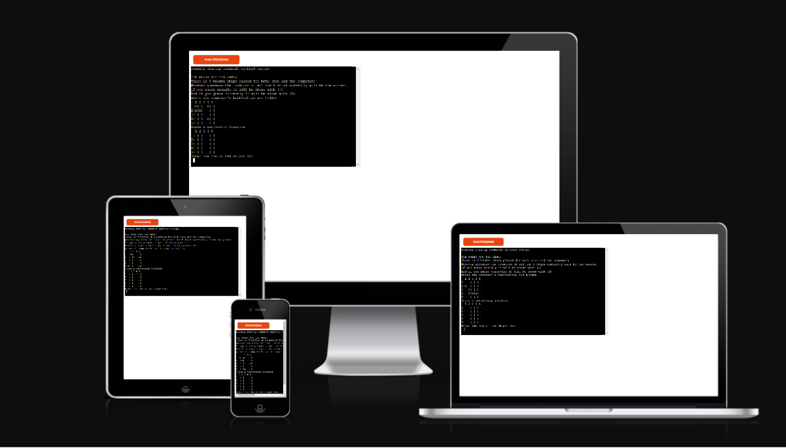
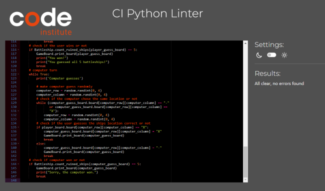

# Battleship Game
***
[Link for Repository]()

[Link for Life game]()

Battleship is an online strategy board game in which you have to sink the hidden ships of your opponent. Think wisely and use battle tactics to defeat the computer. 

## How to play
***
Battleship is based on the classic pen and paper game. You can read more about it on [Wikipedia](https://en.wikipedia.org/wiki/Battleship_(game)).
In this version,the ships are placed randomly for both computer board and the user board.
the palayer can see where their ships are,demonstrated by an x sign, but they can not see where the computer's ship are.
Wrong guesses are marked on the board with -.Hits are indicated by X.
The player and the computer then take turns to make guesses and try to sink each other's battleship.
The winner is the player who sinks all of their opponent's battleships first.
## Features
***
### ***Existing Features***
* shown a user friendly board to the player
* provide an eplanation to the player on how to play the game
* Random board generation
    * ships are randomly placed on both the player and omputer board
    * player can not see where the computer's ships are.
* Play against the computer
* Accepts user input
* Maintains the number of hitted ships
* Input validation and error-checking
    * The player can not enter coordinates outside the size of the board
    * The player must enter only numbers
    * The player can not enter the same geuss twice
    * the player can not enter empty input
* Used 2 classess for modeling the game data
* announce (the game result) the winner to the player

    
### ***future Features***
* Allow the player to locate the battleships  
* Allow the player to select the number of  the battleships 
* Allow the player to choose the length of the battleships
* Allow the player to choose the board size

## Data Model
***
I decided to use 2 classes (GameBoard and Battleship) as my models.The game creates 4 instances of GameBoard class to hold the player's and computer's board and guess_board.
The GameBoard class stores the board and the method of printing the board for the player.
The Battleship has also methods in relation to the ships and user input : create_ships (randomly place ships in both boards) , get_user_input (get users guesses) , count_ruined_ships (keeo track of the hitted ships)

## Testing
***
I have manually tested the project by  doing the following :
* Passed the code through a PEP8 linter and confirmed that there are no problems
* Tested my code with invalid inputs: string when numbers are expected,out of range inputs,same input twice and empty inputs
* Testes in my local terminal and the Code Institute Heroku terminal
### ***Solved Bugs***
* I faced a typeError when I wanted to assign my variables seprately to Battleship.get_user_input() beacuse it returned a tuple.
* I crossed valueError when the player entered an empty value ,I solve it by adding try and except .
### ***Remaining Bugs***
* No bugs remaining
### ***Validator Testing***
* PEP8
  * No errors were returned from PEP8online.com
  

## Deployment
***
This project was deployed using Code Institute's mock terminal for Heroku. Below are the steps I followed to be able to deploy the terminal to the website:

  1. Create a new Heroku app on the Heroku website.
  2. Set config vars: Port and give it a value of 8000.
  3. Set buildpacks to Python and NodeJS in that order.
  4. Link the Heroku app to the repository on GitHub.
  5. Click on Deploy.

### Create Repository
  
For this I used Github.

 * Go to your profile, and press on "Repositories".
 * Press "New" (Big green button).
 * There I chose to use a template from Code Institute to have everything I needed for this project.
 * Named my project [battleship-game ](https://github.com/Mahsak89/battleship-game).
 * Then clicked on "Create repository".
 * Onces created, I opened the repository and clicked on "Gitpod" to create a new workplace.

### Fork Repository on GitHub

A copy of the GitHub Repository can be made by forking the GitHub account. Changes can be made on this copy without affecting the origional repository.

* Log in to GitHub and locate the repository in question.
* Locate the Fork button which can be found in the top corner, right-hand side of the page, inline with the repository name.
* Click this button to create a copy of the origional repository in your GitHub Account.

###  To Clone The Repository on GitHub

* Click on the code button which is underneath the main tab and repository name to the right.
* In the "Clone with HTTPS' section, click on the clipboard icon to copy the URL.
* Open Git Bash in your IDE of choice.
* Change the current working directory to where you wan the cloned directory to be made.
* Type git clone, and then paste the URL copied form GitHub.
* Press enter and the clone of your repository will be created.
## Credits
***
 * Slack community for information and also the few that helped me with the issues what I got. 
 * [CodeInstitute](https://learn.codeinstitute.net/courses).
 * [GreeksforGreeks](https://www.geeksforgeeks.org/indentation-in-python/)
 * [YouTube](https://www.youtube.com/results?search_query=python+battleship+game)
 